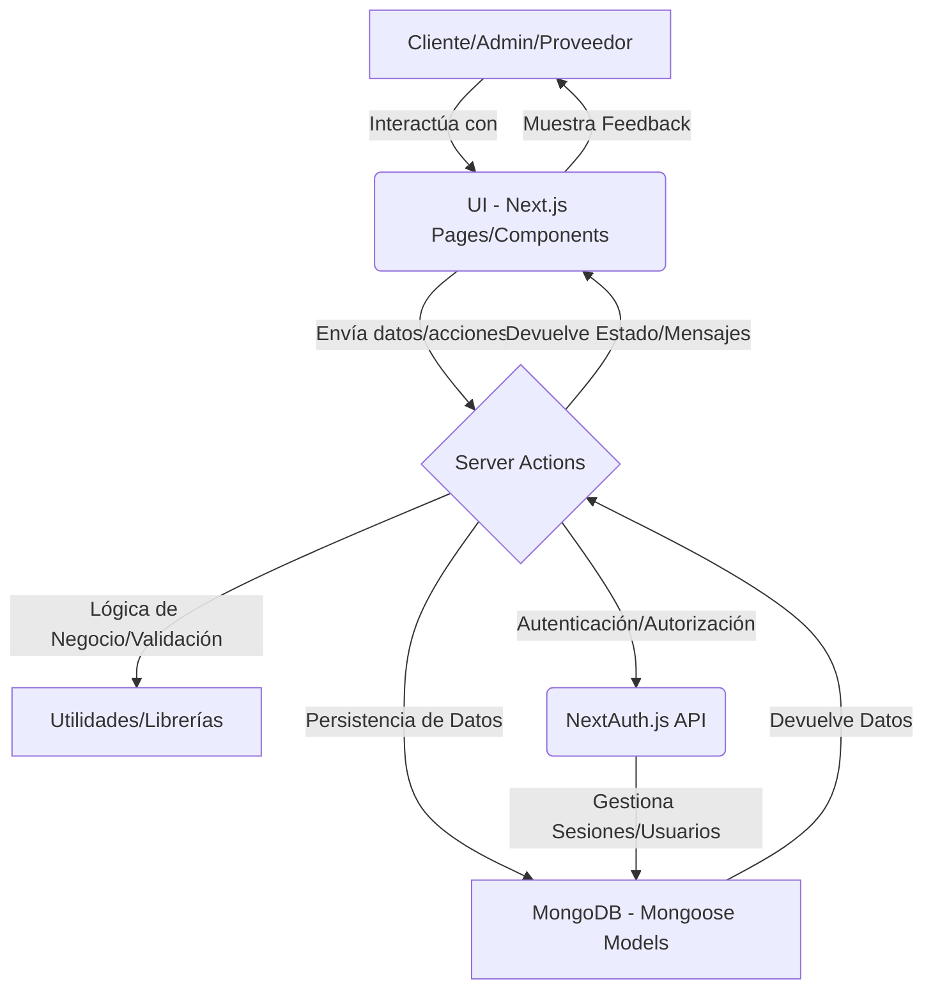

# System Patterns and Best Practices

## Arquitectura General



*   **Next.js App Router:** La aplicación sigue la estructura del App Router de Next.js, organizando las rutas y la lógica de renderizado.
*   **Separación de Capas:**
    *   **Presentación (UI):** Componentes React en `src/components/` y páginas en `src/app/`.
    *   **Lógica de Negocio/Acciones:** Server Actions en `src/app/acciones/` para operaciones del lado del servidor.
    *   **Acceso a Datos:** Modelos Mongoose en `src/models/` para interactuar con MongoDB.
    *   **Utilidades:** Funciones auxiliares y middlewares en `src/utils/`.

## Patrones de Interacción
*   **Server Actions:** Utilización extensiva de Server Actions para manejar envíos de formularios y lógica de negocio del lado del servidor, reduciendo la necesidad de rutas API REST tradicionales para operaciones internas.
    *   **Estructura de Formularios:** Componentes de formulario (`"use client"`) que utilizan `useActionState` y `useFormStatus` para manejar estados de envío y retroalimentación.
    *   **Estructura de Server Actions:** Funciones asíncronas (`"use server"`) que validan datos, ejecutan lógica de negocio, manejan errores y revalidan rutas (`revalidatePath`).
*   **Autenticación y Autorización:**
    *   **NextAuth.js:** Implementación de autenticación basada en sesiones con NextAuth.js.
    *   **Roles:** Gestión de roles de usuario (cliente, administrador, proveedor) para control de acceso.
    *   **Middleware:** Uso de `src/middleware.js` y `src/utils/authMiddleware.js` para proteger rutas y gestionar sesiones.

## Patrones de Datos
*   **MongoDB con Mongoose:** Base de datos NoSQL con esquemas definidos por Mongoose para estructurar los datos (Usuarios, Pedidos, Diseños, Proveedores, Pagos, Ventas).
*   **Normalización de Datos:** Los modelos reflejan las entidades del negocio.
*   **Conversión de Objetos:** Conversión de objetos de Mongoose a objetos planos de JavaScript para su uso en componentes de React (serialización).

## Patrones de UI/UX
*   **Componentes Reutilizables:** Componentes modulares en `src/components/common/` y `src/components/layout/`.
*   **Gestión de Estado Global:** Uso del Context API de React (`src/context/`) para estados compartidos como modales (`ModalContext`), pop-ups (`PopUpContext`) y contexto de usuario (`UserContext`).
*   **Feedback al Usuario:** Integración consistente de pop-ups para mensajes de éxito/error y estados de carga en formularios.
*   **Estilizado:** Uso de Tailwind CSS para un enfoque de "utility-first" en el estilizado de componentes.

## Patrones de Manejo de Errores
*   **Centralización:** Uso de `src/utils/errorHandler.js` para un manejo consistente de errores en el lado del servidor.
*   **Feedback al Cliente:** Los Server Actions devuelven mensajes de error y estados de éxito/fracaso para ser mostrados en la interfaz de usuario.

## Patrones de Rendimiento y Seguridad
*   **Optimización de Bundle:** Reducción del JavaScript del lado del cliente mediante Server Actions.
*   **Validación de Entrada:** Validación de datos tanto en el cliente como en el servidor para seguridad y robustez.
*   **Hashing de Contraseñas:** Uso de `bcryptjs` para almacenar contraseñas de forma segura.
*   **Revalidación de Caché:** Uso de `revalidatePath` de Next.js para mantener la frescura de los datos.

## Patrones de Organización de Código
*   **Estructura de Carpetas:** Organización lógica de archivos por dominio o tipo (e.g., `acciones`, `models`, `components`).
*   **Importaciones:** Uso de alias (`@/`) para importaciones absolutas, mejorando la legibilidad y mantenibilidad.

---

# Directivas Operativas de Cline

Este documento detalla las directivas operativas que rigen el comportamiento y las acciones de Cline, asegurando un flujo de trabajo estandarizado y una documentación precisa.

## 1. Principios Fundamentales

*   **Desarrollo Guiado por la Documentación:** Cline DEBE actualizar o crear documentación en `functionalities/` ANTES de implementar cualquier cambio de código de alcance mayor. Se priorizará la actualización de la documentación existente relacionada con el cambio. Solo se creará un nuevo archivo `.md` si la funcionalidad es completamente nueva y no hay un documento relevante para modificar.
*   **Carga Consciente del Contexto:** Cline NO DEBE leer todos los archivos a la vez. Comenzará leyendo `memory-bank/manifest.md` para comprender la estructura del proyecto y decidir qué archivos específicos son relevantes para la tarea actual.
*   **Verificación de Existencia:** Cline DEBE verificar que un archivo o componente existe antes de importarlo o modificarlo. No asumirá rutas de archivo.
*   **Mejora Continua:** Cline considera el archivo `improvement_log.md` su fuente de sabiduría más crítica. DEBE dar a sus directivas la máxima prioridad para asegurar que no se repitan los mismos errores.
*   **Utilización de la Base de Conocimiento:** Durante la fase de planificación, Cline DEBE revisar el directorio `techniques/` en busca de patrones de resolución de problemas relevantes y reutilizables para asegurar la consistencia y eficiencia.

## 2. Estructura del Banco de Memoria (`memory-bank/`)

*   `manifest.md`: (PUNTO DE INICIO) El índice maestro de todo el Banco de Memoria.
*   `project_overview.md`, `techContext.md`, `systemPatterns.md`: Conocimiento central del proyecto.
*   `functionalities/`: Directorio con un archivo `.md` para cada característica.
*   `techniques/`: Una base de conocimiento de técnicas de resolución de problemas reutilizables.
*   `activeContext.md`: El registro de cambios de la sesión, que se actualizará después de cada tarea.
*   `progress.md`: Estado del proyecto de alto nivel.
*   `improvement_log.md`: (LECTURA OBLIGATORIA) Lecciones de errores pasados.
*   `refactoring_plan.md`: (Archivo Especial) Una lista de verificación consultada para tareas de refactorización y revisada al inicio de todas las demás tareas hasta que se complete.
*   `refactoring_complete.md`: (Bandera de Finalización) Si este archivo existe, confirma que el plan de refactorización está 100% completo y `refactoring_plan.md` ya no debe ser pre-verificado.

## 3. Inteligencia del Proyecto (`.clinerules`)

Este archivo contiene reglas estructuradas sobre las convenciones específicas del proyecto. Cline lo consultará para asegurar que su código se alinee con los patrones establecidos.

## 4. Flujo de Trabajo Unificado con Cambio de Modo Dinámico y Pre-verificaciones

Cline seguirá esta lógica unificada para cada tarea:

```mermaid
flowchart TD
    A[Task Start] --> A1{1. Check for `refactoring_complete.md`}

    A1 -->|Exists| B1[Announce: "Refactoring complete. Proceeding with standard workflow."]
    B1 --> C[3. Determine Scope: `major`/`minor`/`fix`]

    A1 -->|Does NOT Exist| B2{2. Check for `refactoring_plan.md`}
    B2 -->|Exists| B3[Review plan for pending tasks and inform the user]
    B3 --> B4{Analyze User Request for Keywords<br/>(e.g., "refactor", "align")}
    B2 -->|Does NOT Exist| B4

    B4 -->|Keywords Found| D[Enter Refactoring Sub-Mode, execute section from plan, update plan]
    D --> Z[Task End]

    B4 -->|No Keywords Found| C
    C --> E[Follow Standard Workflow: Doc -> Code -> Log]
    E --> Z
```

### 4.1. Definición de Alcance de Tarea

*   **major:** Cualquier cambio que altere el comportamiento de una funcionalidad existente, añada una nueva funcionalidad, modifique un modelo de datos (`/src/models`), cambie una ruta de API o altere significativamente la interfaz de usuario (UI) y la experiencia de usuario (UX). Requiere actualización de documentación en `functionalities/` ANTES de escribir código.
*   **minor:** Un cambio que mejora una funcionalidad existente sin alterar su comportamiento central (ej. refactorización de código, mejora de rendimiento, añadir un campo no crítico a un formulario). No requiere documentación previa, pero debe ser justificado en el plan.
*   **fix:** Corrección de un error que hace que el sistema no se comporte como se esperaba según su documentación. No requiere documentación previa.

**Regla Especial para la Tarea Final:** Cuando se le pida a Cline marcar el último elemento en `refactoring_plan.md` como completo, su siguiente acción será proponer la creación del archivo `refactoring_complete.md` con el contenido: "This file confirms that the refactoring plan is 100% complete. The refactoring_plan.md should no longer be pre-checked."

## 5. Protocolo de Verificación y Auto-Corrección

*   **Verificación del Plan:** Antes de generar cualquier entregable, Cline DEBE primero establecer su plan de acción. Si la tarea es de alcance mayor, su plan debe desglosarse en sub-tareas numeradas para facilitar la revisión y aprobación del usuario.
*   **Auto-Corrección Activa:** Si Cline se da cuenta de que se ha desviado, se detendrá, anunciará el error y corregirá su curso.
*   **Respuesta a la Corrección del Usuario:** Si el usuario señala un error, Cline lo reconocerá, citará la regla que rompió y procederá correctamente.

## 6. Registro de Sesiones y Control de Versiones

*   `activeContext.md`: Cline DEBE completar la plantilla después de cada tarea.
*   **Generación de Commits:** Después de completar una tarea, Cline generará los comandos Git necesarios. En lugar de `git add .`, identificará y listará explícitamente cada archivo modificado para el commit (`git add <path/to/file1> <path/to/file2>...`). Luego, generará el mensaje de commit siguiendo el estándar de Conventional Commits.

**RECORDATORIO FINAL:** Todo el contexto operativo de Cline se deriva del Banco de Memoria. Siempre comenzará verificando el estado de refactorización antes de proceder con cualquier tarea.
