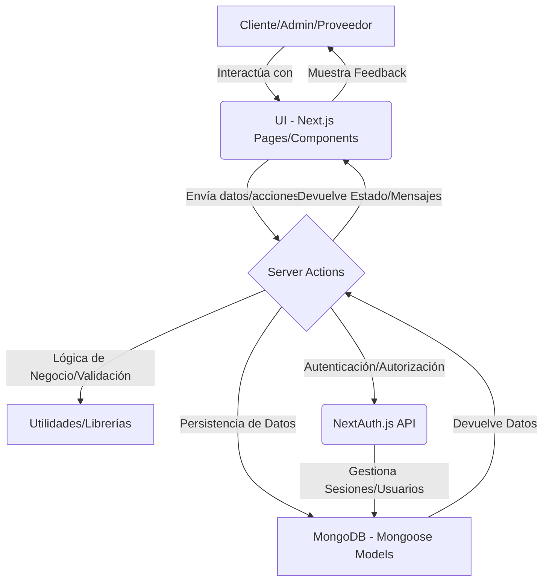

# System Patterns and Best Practices

## Arquitectura General

*   **Next.js App Router:** La aplicación sigue la estructura del App Router de Next.js, organizando las rutas y la lógica de renderizado.
*   **Separación de Capas:**
    *   **Presentación (UI):** Componentes React en `src/components/` y páginas en `src/app/`.
    *   **Lógica de Negocio/Acciones:** Server Actions en `src/app/acciones/` para operaciones del lado del servidor.
    *   **Acceso a Datos:** Modelos Mongoose en `src/models/` para interactuar con MongoDB.
    *   **Utilidades:** Funciones auxiliares y middlewares en `src/utils/`.

## Patrones de Interacción
*   **Server Actions:** Utilización extensiva de Server Actions para manejar envíos de formularios y lógica de negocio del lado del servidor, reduciendo la necesidad de rutas API REST tradicionales para operaciones internas.
    *   **Estructura de Formularios:** Componentes de formulario (`"use client"`) que utilizan `useActionState` y `useFormStatus` para manejar estados de envío y retroalimentación.
    *   **Estructura de Server Actions:** Funciones asíncronas (`"use server"`) que validan datos, ejecutan lógica de negocio, manejan errores y revalidan rutas (`revalidatePath`).
*   **Autenticación y Autorización:**
    *   **NextAuth.js:** Implementación de autenticación basada en sesiones con NextAuth.js.
    *   **Roles:** Gestión de roles de usuario (cliente, administrador, proveedor) para control de acceso.
    *   **Middleware:** Uso de `src/middleware.js` y `src/utils/authMiddleware.js` para proteger rutas y gestionar sesiones.

## Patrones de Datos
*   **MongoDB con Mongoose:** Base de datos NoSQL con esquemas definidos por Mongoose para estructurar los datos (Usuarios, Pedidos, Diseños, Proveedores, Pagos, Ventas).
*   **Normalización de Datos:** Los modelos reflejan las entidades del negocio.
*   **Conversión de Objetos:** Conversión de objetos de Mongoose a objetos planos de JavaScript para su uso en componentes de React (serialización).

## Patrones de UI/UX
*   **Componentes Reutilizables:** Componentes modulares en `src/components/common/` y `src/components/layout/`.
*   **Gestión de Estado Global:** Uso del Context API de React (`src/context/`) para estados compartidos como modales (`ModalContext`), pop-ups (`PopUpContext`) y contexto de usuario (`UserContext`).
*   **Feedback al Usuario:** Integración consistente de pop-ups para mensajes de éxito/error y estados de carga en formularios.
*   **Estilizado:** Uso de Tailwind CSS para un enfoque de "utility-first" en el estilizado de componentes.

## Patrones de Manejo de Errores
*   **Centralización:** Uso de `src/utils/errorHandler.js` para un manejo consistente de errores en el lado del servidor.
*   **Feedback al Cliente:** Los Server Actions devuelven mensajes de error y estados de éxito/fracaso para ser mostrados en la interfaz de usuario.

## Patrones de Rendimiento y Seguridad
*   **Optimización de Bundle:** Reducción del JavaScript del lado del cliente mediante Server Actions.
*   **Validación de Entrada:** Validación de datos tanto en el cliente como en el servidor para seguridad y robustez.
*   **Hashing de Contraseñas:** Uso de `bcryptjs` para almacenar contraseñas de forma segura.
*   **Revalidación de Caché:** Uso de `revalidatePath` de Next.js para mantener la frescura de los datos.

## Patrones de Organización de Código
*   **Estructura de Carpetas:** Organización lógica de archivos por dominio o tipo (e.g., `acciones`, `models`, `components`).
*   **Importaciones:** Uso de alias (`@/`) para importaciones absolutas, mejorando la legibilidad y mantenibilidad.
