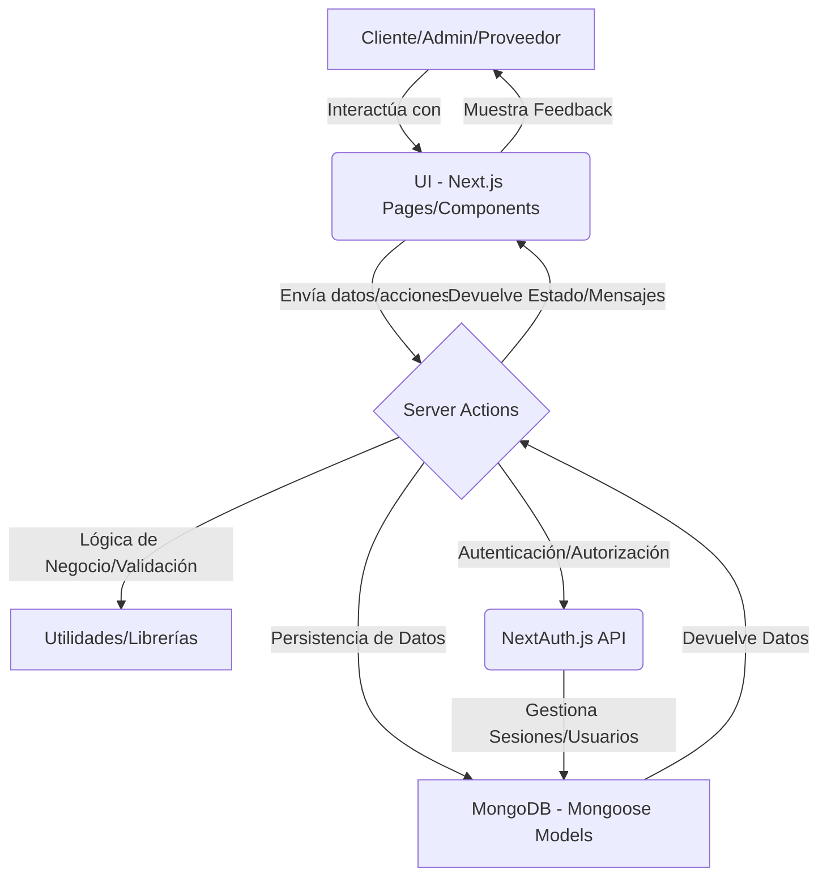

# Guía de Onboarding para Nuevos Desarrolladores: Contexto del Proyecto Black Noise Next.js

¡Bienvenido al equipo de desarrollo de Black Noise Next.js!

Este documento está diseñado para proporcionarte una visión integral del proyecto, su propósito, la pila tecnológica, los patrones de diseño y las funcionalidades clave. Nuestro objetivo es que te familiarices rápidamente con el ecosistema y puedas contribuir de manera efectiva.

---

## 1. Resumen del Proyecto (project_overview.md)

# Project Overview

**Misión:** Desarrollar una plataforma de comercio electrónico integral para la gestión y venta de diseños o productos personalizados, facilitando la interacción fluida y segura entre usuarios, administradores y proveedores.

**Objetivos:**
*   **Proveer un catálogo de diseños intuitivo y funcional para los usuarios:** Lograr una tasa de conversión del 3% en la exploración de productos y un tiempo promedio de búsqueda inferior a 30 segundos.
*   **Implementar un sistema robusto de autenticación y gestión de perfiles para diferentes roles (usuario, administrador, proveedor):** Asegurar una tasa de éxito del 99% en los intentos de inicio de sesión y reducir el tiempo de registro a menos de 2 minutos.
*   **Establecer un flujo de compra completo, incluyendo carrito, proceso de pago y confirmación de pedidos:** Alcanzar una tasa de finalización de compra del 75% y reducir los errores de pago en un 90%.
*   **Ofrecer herramientas de administración para la gestión de usuarios, diseños, pedidos, pagos y ventas:** Reducir el tiempo de gestión de pedidos en un 50% para los administradores y mejorar la precisión de los reportes de ventas en un 95%.
*   **Desarrollar un portal dedicado para proveedores que les permita gestionar sus pedidos y productos:** Aumentar la eficiencia en la gestión de pedidos de proveedores en un 40% y mejorar la satisfacción del proveedor en un 20%.

# Product Context

**Propósito del Proyecto:** El proyecto "Black Noise Next.js" busca resolver la necesidad de un mercado digital especializado en diseños o productos personalizados. Proporciona una plataforma centralizada donde los usuarios pueden explorar y adquirir creaciones únicas, los diseñadores/proveedores pueden ofrecer sus obras y gestionar sus ventas, y los administradores pueden supervisar y mantener la operación completa del negocio.

**Perspectiva del Usuario:**
*   **Usuarios Principales:**
    *   **Clientes:** Individuos que buscan diseños o productos personalizados. Actualmente, los clientes crean sus propios diseños utilizando una aplicación de escritorio (editor de ropa). La meta es que estos diseños se reflejen en la aplicación web, lo cual se aborda de forma manual: el usuario sube la foto de su diseño e indica otras características relevantes. Desean una experiencia de compra fluida y segura, y necesitan gestionar sus pedidos y perfiles.
    *   **Proveedores:** Son los encargados de fabricar los diseños creados por los usuarios. Necesitan una interfaz para gestionar los pedidos de fabricación y sus datos de perfil. No venden productos directamente.
    *   **Administradores:** Personal encargado de la gestión operativa de la plataforma, incluyendo usuarios, proveedores, diseños, pedidos, pagos y análisis de ventas.
*   **Necesidades y Puntos de Dolor:**
    *   **Clientes:** "Me frustra no encontrar diseños únicos fácilmente y los procesos de compra suelen ser complicados, dejándome sin saber el estado de mi pedido."
    *   **Proveedores:** "Como creador, invierto horas en mis diseños, pero pierdo tiempo y posibles ventas gestionando pedidos por email y hojas de cálculo. Siento que mi trabajo se devalúa por no tener una vitrina profesional y automatizada."
    *   **Administradores:** "La gestión de la plataforma es un caos; no tengo herramientas centralizadas para supervisar eficientemente a usuarios, proveedores, diseños y el flujo de ventas, lo que me quita tiempo valioso."
*   **Beneficios Clave:**
    *   **Para Clientes:** Acceso fácil a un catálogo diverso y curado, proceso de compra simplificado y seguro, y seguimiento transparente de pedidos.
    *   **Para Proveedores:** Un canal de ventas dedicado y profesional, herramientas intuitivas para la gestión eficiente de pedidos y productos, y mayor visibilidad para sus creaciones.
*   **Para Administradores:** Panel de control centralizado con herramientas de automatización, visibilidad completa de las operaciones y reportes detallados para la toma de decisiones.

---

## 2. Contexto Tecnológico (techContext.md)

# Tech Context

## Tecnologías Utilizadas

### Frontend
*   **Next.js (v15.3.1):** Framework de React para la construcción de aplicaciones web con renderizado del lado del servidor (SSR), generación de sitios estáticos (SSG) y rutas API.
*   **React (v19.1.0):** Librería principal para la construcción de interfaces de usuario interactivas.
*   **Tailwind CSS (v4):** Framework CSS de utilidad para un estilizado rápido y consistente.
*   **Framer Motion (v12.15.0):** Librería para animaciones y transiciones fluidas en la interfaz de usuario.
*   **JavaScript (ES6+):** Lenguaje de programación principal.

### Backend / API
*   **Next.js API Routes / Server Actions:** Utilizados para manejar la lógica del lado del servidor, incluyendo operaciones CRUD y autenticación.
*   **Node.js:** Entorno de ejecución para Next.js.
*   **Mongoose (v8.14.0):** ODM (Object Data Modeling) para MongoDB, facilitando la interacción con la base de datos.
*   **NextAuth.js (v4.24.11):** Librería de autenticación para Next.js, que soporta múltiples estrategias de autenticación.
*   **Bcryptjs (v3.0.2):** Para el hashing seguro de contraseñas.
*   **Nodemailer (v6.10.1):** Para el envío de correos electrónicos (posiblemente para confirmaciones de pedidos, restablecimiento de contraseñas, etc.).

### Base de Datos
*   **MongoDB:** Base de datos NoSQL orientada a documentos, utilizada para almacenar la información del proyecto.

### Herramientas y Librerías Adicionales
*   **Axios (v1.9.0):** Cliente HTTP para realizar solicitudes a APIs.
*   **PapaParse (v5.5.2):** Para el parseo de archivos CSV (posiblemente para carga masiva de datos, como productos o usuarios).
*   **jsPDF (v3.0.1) & jspdf-autotable (v5.0.2):** Para la generación de documentos PDF (posiblemente para facturas, reportes de ventas, etc.).
*   **ESLint (v9):** Herramienta de linting para mantener la calidad y consistencia del código.
*   **npm/yarn:** Gestores de paquetes.

## Entorno de Desarrollo
*   **Prerrequisitos:** Node.js, npm/yarn, instancia de MongoDB.
*   **Configuración:** Uso de variables de entorno (`.env.local`) para la URI de MongoDB, el secreto de NextAuth y la URL de NextAuth.
*   **Ejecución:** `npm run dev` para iniciar el servidor de desarrollo.

## Justificación de Decisiones Clave
*   **Next.js:** Se eligió por su capacidad de renderizado en el servidor (SSR) y generación estática (SSG), lo que es ideal para el SEO de los productos y un rendimiento rápido en el catálogo. Las Server Actions simplifican el backend y permiten una arquitectura full-stack con React.
*   **Tailwind CSS:** Se seleccionó para acelerar el desarrollo de la UI y mantener una consistencia visual sin necesidad de escribir CSS personalizado extensivo, promoviendo un enfoque de "utility-first".
*   **MongoDB con Mongoose:** Se optó por MongoDB debido a su flexibilidad de esquema, ideal para un proyecto que podría evolucionar rápidamente en sus modelos de datos. Mongoose proporciona una capa de abstracción robusta para la interacción con la base de datos.
*   **NextAuth.js:** Elegido por su integración nativa con Next.js y su soporte para múltiples proveedores de autenticación, facilitando la implementación de un sistema de autenticación seguro y escalable.

## Limitaciones Técnicas
*   **Next.js Server Actions/API Routes:** Posibles problemas de "cold start" o límites de tiempo de ejecución en entornos serverless.
*   **Flexibilidad de MongoDB:** Requiere una gestión cuidadosa de los esquemas con Mongoose para evitar inconsistencias de datos.
*   **Autenticación:** La personalización de la lógica de autenticación con NextAuth.js puede requerir una integración profunda.

---

## 3. Patrones del Sistema (systemPatterns.md)

# System Patterns and Best Practices

## Arquitectura General



*   **Next.js App Router:** La aplicación sigue la estructura del App Router de Next.js, organizando las rutas y la lógica de renderizado.
*   **Separación de Capas:**
    *   **Presentación (UI):** Componentes React en `src/components/` y páginas en `src/app/`.
    *   **Lógica de Negocio/Acciones:** Server Actions en `src/app/acciones/` para operaciones del lado del servidor.
    *   **Acceso a Datos:** Modelos Mongoose en `src/models/` para interactuar con MongoDB.
    *   **Utilidades:** Funciones auxiliares y middlewares en `src/utils/`.

## Patrones de Interacción
*   **Server Actions:** Utilización extensiva de Server Actions para manejar envíos de formularios y lógica de negocio del lado del servidor, reduciendo la necesidad de rutas API REST tradicionales para operaciones internas.
    *   **Estructura de Formularios:** Componentes de formulario (`"use client"`) que utilizan `useActionState` y `useFormStatus` para manejar estados de envío y retroalimentación.
    *   **Estructura de Server Actions:** Funciones asíncronas (`"use server"`) que validan datos, ejecutan lógica de negocio, manejan errores y revalidan rutas (`revalidatePath`).
*   **Autenticación y Autorización:**
    *   **NextAuth.js:** Implementación de autenticación basada en sesiones con NextAuth.js.
    *   **Roles:** Gestión de roles de usuario (cliente, administrador, proveedor) para control de acceso.
    *   **Middleware:** Uso de `src/middleware.js` y `src/utils/authMiddleware.js` para proteger rutas y gestionar sesiones.

## Patrones de Datos
*   **MongoDB con Mongoose:** Base de datos NoSQL con esquemas definidos por Mongoose para estructurar los datos (Usuarios, Pedidos, Diseños, Proveedores, Pagos, Ventas).
*   **Normalización de Datos:** Los modelos reflejan las entidades del negocio.
*   **Conversión de Objetos:** Conversión de objetos de Mongoose a objetos planos de JavaScript para su uso en componentes de React (serialización).

## Patrones de UI/UX
*   **Componentes Reutilizables:** Componentes modulares en `src/components/common/` y `src/components/layout/`.
*   **Gestión de Estado Global:** Uso del Context API de React (`src/context/`) para estados compartidos como modales (`ModalContext`), pop-ups (`PopUpContext`) y contexto de usuario (`UserContext`).
*   **Feedback al Usuario:** Integración consistente de pop-ups para mensajes de éxito/error y estados de carga en formularios.
*   **Estilizado:** Uso de Tailwind CSS para un enfoque de "utility-first" en el estilizado de componentes.

## Patrones de Manejo de Errores
*   **Centralización:** Uso de `src/utils/errorHandler.js` para un manejo consistente de errores en el lado del servidor.
*   **Feedback al Cliente:** Los Server Actions devuelven mensajes de error y estados de éxito/fracaso para ser mostrados en la interfaz de usuario.

## Patrones de Rendimiento y Seguridad
*   **Optimización de Bundle:** Reducción del JavaScript del lado del cliente mediante Server Actions.
*   **Validación de Entrada:** Validación de datos tanto en el cliente como en el servidor para seguridad y robustez.
*   **Hashing de Contraseñas:** Uso de `bcryptjs` para almacenar contraseñas de forma segura.
*   **Revalidación de Caché:** Uso de `revalidatePath` de Next.js para mantener la frescura de los datos.

## Patrones de Organización de Código
*   **Estructura de Carpetas:** Organización lógica de archivos por dominio o tipo (e.g., `acciones`, `models`, `components`).
*   **Importaciones:** Uso de alias (`@/`) para importaciones absolutas, mejorando la legibilidad y mantenibilidad.

---

## 4. Funcionalidades (functionalities/)

### 4.1. Gestión de Detalles de Usuario en el Panel de Administración (admin_manage_user_details.md)

# Gestión de Detalles de Usuario en el Panel de Administración

## Descripción
Esta funcionalidad permite a los administradores ver una lista de todos los usuarios registrados en el sistema y editar sus detalles completos (nombre, documento, correo, rol, etc.). Actualmente, la página de administración de usuarios (`src/app/admin/users/page.jsx`) solo permite la gestión de la foto de perfil. Esta nueva implementación añadirá una tabla de usuarios con un botón "Editar" para cada entrada, que redirigirá a una página de edición de detalles de usuario.

## Componentes Involucrados

### Frontend
*   **`src/app/admin/page.jsx`**: El dashboard principal de administración que renderiza dinámicamente los sub-dashboards.
*   **`src/components/layout/admin/dashboards/UsuariosDashboard.jsx`**: El componente que actualmente gestiona la foto de perfil. Será modificado para incluir o integrar un nuevo componente de tabla de usuarios.
*   **`src/components/layout/admin/dashboards/UsuariosClientPage.jsx`**: Este componente ahora contiene directamente la lógica y el JSX para renderizar la tabla de usuarios, incluyendo sus detalles y acciones (Editar, Deshabilitar/Habilitar).
*   **`src/components/layout/admin/usuarios/modals/ModalEditarUsuario.jsx`**: Este modal se utiliza para la edición de usuarios. Se ha ajustado su comportamiento de altura y desbordamiento para asegurar que todo el contenido del formulario (`FormEditarUsuario`) sea visible y se pueda desplazar verticalmente si excede el espacio disponible. La gestión principal del scroll y la altura máxima ahora recae en el componente genérico `Modal` (`src/components/common/modales/Modal.jsx`), eliminando restricciones redundantes en este componente.
*   **`src/components/common/modales/Modal.jsx`**: El componente modal genérico que proporciona la estructura base y el manejo de altura máxima (`max-h-[calc(100vh-10rem)]`) y desbordamiento (`overflow-y-auto`) para su contenido.
*   **`src/components/layout/admin/usuarios/forms/FormEditarUsuario.jsx`**: El formulario de edición de usuario que se renderiza dentro de `ModalEditarUsuario`. Su contenido ahora se adapta correctamente al espacio disponible y permite el scroll a través del modal padre.
*   **`src/app/admin/users/editar/[id]/page.jsx` (NUEVO)**: Una nueva página de Next.js que contendrá el formulario para editar los detalles de un usuario específico.
*   **`src/components/layout/admin/users/EditUserForm.jsx` (NUEVO)**: Un componente de formulario reutilizable para la edición de usuarios.

### Backend (Acciones de Servidor)
*   **`src/app/acciones/UsuariosActions.js`**: Este archivo ya contiene las funciones necesarias para:
    *   `ObtenerTodosLosUsuarios()`: Para obtener la lista de usuarios.
    *   `ObtenerUsuarioPorId(id)`: Para obtener los detalles de un usuario específico.
    *   `EditarUsuario(id, formData)`: Para actualizar los detalles de un usuario.
    *   `updateUserAction(userId, prevState, formData)`: Server Action que envuelve `EditarUsuario`.
    *   `toggleUsuarioHabilitado(formData)`: Para cambiar el estado de habilitado/deshabilitado de un usuario.

## Flujo de Trabajo

1.  El administrador navega a la sección de "Usuarios" en el panel de administración.
2.  `UsuariosDashboard.jsx` renderiza `UsuariosClientPage.jsx`.
3.  `UsuariosClientPage.jsx` obtiene la lista de usuarios usando `ObtenerTodosLosUsuarios` de `UsuariosActions.js` y renderiza la tabla directamente.
4.  La tabla muestra los usuarios con un botón "Editar" para cada uno.
5.  Al hacer clic en "Editar", el usuario es redirigido a `/admin/users/editar/[id]`, donde `[id]` es el ID del usuario.
6.  `src/app/admin/users/editar/[id]/page.jsx` carga el `EditUserForm.jsx`.
7.  `EditUserForm.jsx` obtiene los detalles del usuario usando `ObtenerUsuarioPorId` y precarga el formulario.
8.  El administrador modifica los detalles y envía el formulario.
9.  El formulario llama a `updateUserAction` (que a su vez usa `EditarUsuario`) para guardar los cambios en la base de datos.
10. Tras una actualización exitosa, el administrador es redirigido de vuelta a la lista de usuarios.

## Consideraciones Adicionales

*   Se debe asegurar la validación de datos tanto en el frontend como en el backend para la edición de usuarios.
*   Se debe manejar el estado de carga y los errores durante la obtención y actualización de datos.
*   Se considerará la paginación y filtrado en la tabla de usuarios dentro de `UsuariosClientPage.jsx` para mejorar la experiencia de usuario si la lista de usuarios es extensa.

### 4.2. Gestión de Foto de Perfil de Usuario por Administrador (admin_manage_user_profile_picture.md)

# Funcionalidad: Gestión de Foto de Perfil de Usuario por Administrador

## Objetivo
Permitir a los administradores del sistema la capacidad de cambiar la foto de perfil de cualquier usuario registrado, centralizando la gestión de imágenes de perfil y asegurando la coherencia visual y el control administrativo.

## Flujo de Usuario (Administrador)
1.  **Acceso al Panel de Administración:** El administrador inicia sesión y navega a la sección de gestión de usuarios dentro del panel de administración.
2.  **Selección/Búsqueda de Usuario:** El administrador utiliza una interfaz de búsqueda o listado para encontrar y seleccionar el usuario cuya foto de perfil desea modificar.
3.  **Visualización de Foto Actual:** Una vez seleccionado el usuario, se muestra su foto de perfil actual (si existe).
4.  **Subida de Nueva Imagen:** El administrador interactúa con un campo de subida de archivos (`<input type="file">`) para seleccionar una nueva imagen desde su dispositivo.
5.  **Confirmación y Actualización:** El administrador confirma la subida. La aplicación procesa la imagen y la guarda, reemplazando la foto de perfil existente del usuario en la base de datos.
6.  **Feedback:** Se muestra un mensaje de éxito o error al administrador, indicando el resultado de la operación.

## Proceso Técnico

### 1. Modificaciones en el Modelo de Usuario (`src/models/Usuario.js`)
Para almacenar la foto de perfil directamente en la base de datos (MongoDB), se añadirán o modificarán los siguientes campos en el esquema del modelo `Usuario`:
*   `imageData`: Tipo `Buffer`. Almacenará los datos binarios de la imagen.
*   `imageMimeType`: Tipo `String`. Almacenará el tipo MIME de la imagen (ej. `image/jpeg`, `image/png`).

Estos campos seguirán el patrón ya establecido para el almacenamiento de imágenes de diseño, garantizando la consistencia en la gestión de datos binarios.

### 2. Nueva Server Action (`src/app/acciones/AdminActions.js`)
Se creará una nueva Server Action para manejar la lógica de actualización de la foto de perfil.
*   **Nombre Sugerido:** `actualizarFotoPerfilUsuarioPorAdmin`
*   **Parámetros de Entrada:**
    *   `userId`: ID del usuario cuya foto de perfil se va a actualizar.
    *   `formData`: Objeto `FormData` que contiene el archivo de imagen subido.
*   **Lógica Interna:**
    1.  **Verificación de Rol:** Se realizará una verificación estricta para asegurar que solo los usuarios con rol de "administrador" puedan ejecutar esta acción.
    2.  **Procesamiento de Imagen:**
        *   Extraer el archivo de imagen del `formData`.
        *   Validar el archivo:
            *   **Tamaño Máximo:** Limitar el tamaño del archivo (ej. 5MB).
            *   **Tipos MIME Permitidos:** Aceptar solo tipos de imagen específicos (ej. `image/jpeg`, `image/png`, `image/webp`). Se reutilizará la lógica de validación existente en `DesignActions.js` o se adaptará.
        *   Convertir el archivo de imagen a un `Buffer`.
        *   Obtener el `imageMimeType` del archivo.
    3.  **Actualización en Base de Datos:**
        *   Buscar el documento del usuario por `userId`.
        *   Actualizar los campos `imageData` y `imageMimeType` con los nuevos valores.
        *   Manejar posibles errores de base de datos.
    4.  **Respuesta:** Retornar un objeto con el estado de la operación (éxito/error) y un mensaje.

### 3. Componentes del Frontend (Panel de Administración)
Se desarrollará o modificará la interfaz de usuario en el panel de administración para permitir esta funcionalidad.
*   **Ubicación Sugerida:** Una nueva página o una sección dentro de una página existente de gestión de usuarios (ej. `src/app/admin/users/page.jsx` o `src/components/admin/UserProfilePictureManager.jsx`).
*   **Elementos de UI:**
    *   Un componente para listar y/o buscar usuarios.
    *   Un componente para mostrar los detalles del usuario seleccionado, incluyendo su foto de perfil actual.
    *   Un `<input type="file">` para la subida de la nueva imagen.
    *   Un botón para activar la subida y la llamada a la Server Action.
    *   Indicadores de carga y mensajes de feedback (éxito/error).
*   **Interacción:** Al enviar el formulario, se construirá un objeto `FormData` y se invocará la Server Action `actualizarFotoPerfilUsuarioPorAdmin` con el `userId` y el `FormData`.

## Identificación de Componentes Nuevos o Modificados
*   **Modelo:** `src/models/Usuario.js` (modificación)
*   **Server Action:** `src/app/acciones/AdminActions.js` (nuevo archivo o adición a existente)
*   **Frontend:**
    *   `src/app/admin/users/page.jsx` (modificación o nueva página)
    *   `src/components/admin/UserProfilePictureManager.jsx` (nuevo componente, si se decide modularizar)
    *   Posiblemente un componente de listado/búsqueda de usuarios si no existe uno adecuado.

## Consideraciones de Seguridad
*   **Autorización:** La Server Action `actualizarFotoPerfilUsuarioPorAdmin` DEBE verificar que el usuario que realiza la solicitud tiene el rol de "administrador". Cualquier intento de un usuario no autorizado debe ser rechazado.
*   **Validación de Entrada:** Implementar validaciones robustas para el tipo de archivo y el tamaño de la imagen para prevenir ataques de subida de archivos maliciosos o sobrecarga del servidor/base de datos.
*   **Manejo de Errores:** Asegurar que los mensajes de error no expongan información sensible del sistema o de la base de datos.

## Pruebas Conceptuales
*   **Subida Exitosa:**
    *   Un administrador sube una imagen JPG válida para un usuario existente.
    *   Verificar que la imagen se actualiza correctamente en la base de datos y se muestra en la interfaz.
*   **Intento por No-Administrador:**
    *   Un usuario sin rol de administrador intenta llamar a la Server Action.
    *   Verificar que la acción es rechazada y se retorna un error de autorización.
*   **Tipo de Archivo Inválido:**
    *   Un administrador intenta subir un archivo que no es una imagen (ej. `.pdf`, `.txt`).
    *   Verificar que la validación falla y se muestra un mensaje de error apropiado.
*   **Archivo Muy Grande:**
    *   Un administrador intenta subir una imagen que excede el tamaño máximo permitido.
    *   Verificar que la validación falla y se muestra un mensaje de error apropiado.
*   **Usuario Inexistente:**
    *   Un administrador intenta cambiar la foto de perfil de un `userId` que no existe.
    *   Verificar que la acción maneja este caso y retorna un error.
*   **Visualización Correcta:**
    *   Después de una subida exitosa, verificar que la nueva foto de perfil se renderiza correctamente en la interfaz de usuario del administrador y, si aplica, en la vista de perfil del usuario.

### 4.3. Carrito (Cart.md)

# Cart Functionality

## Overview

This document describes the `Cart` model and its associated functionality, which has been refactored to integrate directly into the user's profile section. The dedicated `/carrito` page has been removed.

## Purpose

The primary purpose of the `Cart` model and its functionality is to:
- Persist the selected design IDs and quantities for a user's shopping cart.
- Enable efficient retrieval and display of design information within the cart component in the user's profile section.
- Facilitate the process of creating an order directly from the user's profile.

## Data Structure

The `Cart` model has the following schema:

- `userId`: (String, Required, Unique) The ID of the user to whom this cart belongs. This ensures each user has a single cart.
- `items`: (Array of Objects, Default: []) An array containing objects, each with:
    - `designId`: (ObjectId, Ref: 'Design') The ID of the design.
    - `quantity`: (Number, Default: 1) The quantity of this design in the cart.

## Usage

### Managing Cart Items

When a user adds a design to their cart, the `designId` and quantity are managed within the `items` array of their corresponding `Cart` document. If a cart document does not exist for the user, a new one will be created. Server actions handle all interactions with the database for adding, removing, updating quantities, and clearing the cart.

### Displaying Cart Information

The cart information is now displayed exclusively within the user's profile, under the "Carrito" tab. The `CartComponent` fetches the cart data and renders the list of items, along with a summary of the total cost and options to clear the cart or proceed to order creation.

Additionally, the cart data (specifically `cartItems`) obtained from the database via `getCartByUserId` is passed as a prop to `DesignsComponent.jsx`. This ensures that the "En el carrito" status for individual designs in the "Diseños" tab of the user's profile is accurately reflected based on the persistent cart data.

### Order Creation

The "Realizar Pedido" button in the cart now triggers the creation of a new order. This process involves:
1.  Gathering the current cart items and user information. In `CartComponent.jsx`, the `designId` for each item is now correctly extracted from `item.id` (which is populated by `getCartByUserId`).
2.  Sending this data to a new server action responsible for creating a `Pedido` (Order) document in the database.
3.  Clearing the user's cart after successful order creation. The payment for this order will be handled separately from the user's order history.
    *   **Update:** The user's cart is now explicitly cleared on the backend using the `clearUserCart` server action after a successful payment is processed for an order. This ensures that items are removed from the cart once they have been purchased.

## Interaction Flow: Client-side to Server-side Cart

The client-side cart management is synchronized with the server-side `Cart` model via server actions.

1.  **Client-side Action**: When a user interacts with cart functionality (e.g., "Add to Cart", "Remove Item", "Update Quantity", "Clear Cart", "Pagar Ahora"), the relevant server action from `src/app/acciones/CartActions.js` or `src/app/acciones/PedidoActions.js` is invoked.
2.  **Server Action Call**: Server actions receive the `userId` and design-specific data (e.g., `designId`, `newQuantity`) or cart data for order creation.
3.  **Server-side Logic**:
    *   The server action connects to the database.
    *   It performs the necessary CRUD operations on the `Cart` document (create, read, update, delete items) or creates a `Pedido` document.
    *   `revalidatePath('/perfil')` is used to ensure the user's profile page (where the cart is displayed) reflects the latest cart state.
    *   The server returns a success or error response.
4.  **Client-side Update**: Based on the server's response, the `CartComponent` updates its local state to reflect the changes, ensuring consistency in the UI.

## Related Components/Files

- `src/models/Cart.js`: The Mongoose schema definition for the Cart model.
- `src/app/acciones/CartActions.js`: Server actions to handle all server-side cart operations (add, remove, update quantity, clear, get cart).
- `src/app/acciones/PedidoActions.js`: **(New/Modified)** Server actions to handle order creation.
- `src/models/Pedido.js`: **(New/Modified)** The Mongoose schema definition for the Pedido (Order) model.
- `src/components/common/CartComponent.jsx`: The main component responsible for displaying and managing the cart within the user profile. It now includes the full cart display, summary, and order creation initiation.
- `src/components/common/CartItem.jsx`: Renders a single item within the cart list.
- `src/components/layout/ProfileContent.jsx`: The parent component that renders `CartComponent.jsx` when the 'Carrito' tab is active.
- `src/components/layout/general/HeaderPrincipal.jsx`: Updated to link directly to `/perfil` for cart access.
- `src/app/confirmacion/page.jsx`: Updated to redirect to `/perfil` if no order is found.

## UI/UX Changes

The cart functionality has been fully integrated into the user profile.
-   The dedicated `/carrito` page has been removed.
-   The `CartComponent` (`src/components/common/CartComponent.jsx`) now provides the complete cart experience within the user's profile 'Carrito' tab, including:
    -   Display of all cart items with quantity controls and removal options.
    -   Calculation and display of subtotal, shipping, and total to pay.
    -   "Vaciar Carrito" (Clear Cart) button.
    -   "Realizar Pedido" (Place Order) button, which now triggers the order creation process.
-   The `CartLeftPanel`, `CartItemsList`, and `CartSummaryAndPayment` components from `src/components/carrito/` have been removed as their functionality is now consolidated.

### 4.4. Gestión de Imágenes de Diseño (DesignImageManagement.md)

# Gestión de Imágenes de Diseño: Migración de Base64 a Almacenamiento Binario en MongoDB

## 1. Racionamiento del Cambio

Actualmente, las imágenes asociadas a los diseños se almacenan en MongoDB como cadenas de texto codificadas en Base64. Este enfoque, aunque simple de implementar inicialmente, presenta varias desventajas significativas:

*   **Ineficiencia de Almacenamiento:** La codificación Base64 aumenta el tamaño de los datos en aproximadamente un 33% en comparación con los datos binarios originales. Esto consume más espacio en la base de datos y puede impactar los costos de almacenamiento y los tiempos de respaldo/restauración.
*   **Rendimiento:** La conversión constante entre Base64 y binario (tanto al guardar como al recuperar) introduce una sobrecarga de procesamiento que puede afectar el rendimiento de la aplicación, especialmente con un gran volumen de imágenes o imágenes de mayor tamaño.
*   **Limitaciones de Tamaño:** Aunque MongoDB tiene un límite de 16MB por documento BSON, almacenar imágenes grandes en Base64 consume este límite más rápidamente, haciendo que las imágenes de tamaño moderado puedan acercarse o exceder este umbral.

El objetivo de esta refactorización es optimizar el almacenamiento y el manejo de imágenes, migrando a un formato binario nativo en MongoDB. Esto busca mejorar la eficiencia del almacenamiento, reducir el tamaño de los datos y potenciar el rendimiento general del sistema.

## 2. Nuevo Método Técnico Detallado: Almacenamiento Binario con `BinData`

El nuevo enfoque principal será utilizar el tipo `BinData` de MongoDB para incrustar los datos binarios de la imagen directamente en el documento del diseño.

### 2.1. Flujo de Datos

1.  **Frontend (Cliente):**
    *   El usuario selecciona una imagen a través de un input de tipo `file`.
    *   En lugar de leer el archivo y convertirlo a Base64, el frontend preparará el archivo para ser enviado directamente como datos binarios. Esto se logrará típicamente utilizando el objeto `FormData` para encapsular el archivo y otros datos del formulario.
    *   El `FormData` se enviará al backend a través de una solicitud HTTP (ej. `POST` o `PUT`) con el `Content-Type` adecuado (generalmente `multipart/form-data`).

2.  **Backend (Servidor):**
    *   El endpoint de la API (ej. `/api/designs/upload-image`) recibirá la solicitud `multipart/form-data`.
    *   El servidor extraerá el archivo binario de la solicitud. Se utilizarán librerías o middlewares adecuados para el manejo de archivos (ej. `multer` en Node.js con Express, si aplica).
    *   Una vez obtenido el buffer de datos binarios de la imagen, este se almacenará en el documento de MongoDB utilizando el tipo `BinData`. Es crucial almacenar también el `mimetype` (ej. `image/jpeg`, `image/png`) para una correcta recuperación y visualización posterior.
    *   El documento de diseño en MongoDB se actualizará para incluir un campo (ej. `imageData`) de tipo `BinData` y un campo `imageMimeType` de tipo `String`.

### 2.2. Consideraciones de MongoDB (`BinData`)

*   **Tipo de Datos:** MongoDB ofrece el tipo `BinData` para almacenar datos binarios. Este tipo es ideal para incrustar archivos pequeños o medianos directamente en los documentos.
*   **Límite de Tamaño:** Cada documento BSON en MongoDB tiene un límite de tamaño de 16MB. Si las imágenes exceden consistentemente este límite, la opción de `BinData` no será viable y se deberá recurrir a GridFS.
*   **Estructura del Documento (Ejemplo):**

    ```json
    {
      "_id": ObjectId("..."),
      "designName": "Mi Diseño Personalizado",
      "description": "Un diseño único para camisetas.",
      "imageData": BinData(0, "AQIDBAUGBwgJ..."), // Datos binarios de la imagen
      "imageMimeType": "image/png",
      "createdAt": ISODate("..."),
      "updatedAt": ISODate("...")
    }
    ```

## 3. Opción Secundaria/Contingencia: GridFS

Si el análisis determina que las imágenes pueden exceder regularmente el límite de 16MB por documento BSON, o si se busca una solución más robusta para archivos grandes dentro de MongoDB, se considerará el uso de GridFS.

*   **¿Qué es GridFS?** GridFS es una especificación para almacenar y recuperar archivos que exceden el límite de tamaño de documento BSON. Divide el archivo en partes o "chunks" y almacena cada chunk como un documento separado.
*   **Ventajas:** Permite almacenar archivos de cualquier tamaño, gestiona la fragmentación automáticamente.
*   **Desventajas:** Mayor complejidad en la implementación y gestión, ya que requiere interactuar con dos colecciones (`fs.files` y `fs.chunks`).
*   **Caso de Uso:** Ideal para archivos muy grandes (videos, documentos extensos, imágenes de alta resolución que superan los 16MB).

Para esta refactorización, la prioridad es `BinData`. GridFS se documentará como una alternativa si `BinData` demuestra ser insuficiente.

## 4. Impacto en el Rendimiento Esperado

*   **Almacenamiento:** Reducción del espacio en disco utilizado en MongoDB debido a la eliminación de la sobrecarga de Base64.
*   **Escritura/Lectura:** Potencial mejora en los tiempos de escritura y lectura al eliminar las operaciones de codificación/decodificación de Base64. Los datos binarios se manejan de forma más directa.
*   **Red:** Aunque los datos en sí serán más pequeños, el envío de `multipart/form-data` puede tener su propia sobrecarga. Sin embargo, el tamaño neto de los datos transferidos será menor.

## 5. Análisis de Impacto y Componentes a Modificar

### 5.1. Componentes del Frontend

*   **`src/app/acciones/DesignActions.js` (o componente de carga de imágenes):**
    *   Modificar la función responsable de la subida de imágenes para que, en lugar de convertir la imagen a Base64, la añada a un objeto `FormData`.
    *   Asegurar que las validaciones de tamaño y tipo de archivo se realicen antes del envío.
*   **Componentes de Visualización de Imágenes:**
    *   Si las imágenes se recuperan directamente del backend, la lógica de visualización deberá ser capaz de manejar la respuesta binaria (ej. creando un `Blob` y una URL de objeto para `` tags).

### 5.2. Componentes del Backend

*   **`src/app/api/designs/route.js` (o ruta de API de diseños):**
    *   Ajustar el middleware o la lógica de la ruta para parsear solicitudes `multipart/form-data`.
    *   Extraer el archivo binario de la solicitud.
*   **`src/models/Design.js` (Modelo Mongoose/Schema):
    *   Modificar el esquema para incluir un campo de tipo `Buffer` (que Mongoose mapea a `BinData` en MongoDB) para los datos de la imagen y un campo `String` para el `mimetype`.
*   **`src/app/acciones/DesignActions.js` (Lógica de servicio/repositorio):**
    *   Ajustar la lógica para guardar el buffer y el `mimetype` en el documento de `Design`.
    *   Ajustar la lógica de recuperación para servir la imagen binaria con el `Content-Type` HTTP correcto.

### 5.3. Manejo de Errores

*   Implementar manejo de errores para:
    *   Archivos excediendo el límite de tamaño (16MB para `BinData`).
    *   Tipos de archivo no soportados.
    *   Errores de red o de base de datos durante la subida/recuperación.

## 6. Consideración sobre Migración de Datos Existentes

La migración de datos existentes (imágenes almacenadas como Base64) es un aspecto crucial. Se necesitará un script de migración `one-time` para convertir las imágenes Base64 a formato binario (`BinData`) en la base de datos.

### 6.1. Proceso de Migración Propuesto

1.  **Lectura:** Iterar sobre todos los documentos de `Design` que contengan imágenes en formato Base64.
2.  **Decodificación:** Decodificar la cadena Base64 a su buffer binario original.
3.  **Actualización:** Actualizar el documento en MongoDB, reemplazando el campo Base64 con el nuevo campo `imageData` de tipo `BinData` y `imageMimeType`.
4.  **Validación:** Verificar que las imágenes migradas se visualicen correctamente en la aplicación.

La implementación de este script de migración será una tarea de seguimiento separada, pero su análisis y planificación son parte de esta refactorización.

## 7. Casos de Prueba Conceptuales

Para verificar la correcta implementación de la refactorización, se necesitarán los siguientes casos de prueba:

*   **Subida Exitosa:**
    *   Subir imágenes JPG, PNG, WEBP de diferentes tamaños (pequeñas, medianas, cercanas a 15MB).
    *   Verificar que la imagen se guarda correctamente en MongoDB como `BinData` y que el `mimetype` es correcto.
    *   Verificar que la imagen se visualiza correctamente en el frontend después de la subida.
*   **Manejo de Errores:**
    *   Intentar subir un archivo que exceda el límite de 16MB (para `BinData`). Verificar que el sistema maneja el error apropiadamente y notifica al usuario.
    *   Intentar subir un tipo de archivo no soportado (ej. `.txt`, `.pdf`). Verificar el manejo de errores.
*   **Recuperación:**
    *   Recuperar imágenes subidas previamente y verificar su correcta visualización.
    *   Verificar que el `Content-Type` HTTP de la respuesta del backend es el adecuado.
*   **Integridad de Datos:**
    *   Después de la migración (si se implementa), verificar que las imágenes antiguas se visualizan correctamente.

## 8. Plan de Acción Detallado (Post-Documentación)

Una vez que esta documentación sea revisada y aprobada, el plan de acción para la implementación será el siguiente:

1.  **Backend - Modificación del Modelo `Design`:**
    *   Modificar `src/models/Design.js` para cambiar el tipo de campo de imagen de `String` a `Buffer` y añadir un campo para el `mimetype`.
2.  **Backend - Ajuste de la API de Subida:**
    *   Identificar y modificar la ruta de la API en `src/app/api/designs/route.js` (o similar) para manejar `multipart/form-data` y extraer el archivo binario.
    *   Integrar una librería para el manejo de `multipart/form-data` (ej. `multer` si se usa Express, o una solución nativa de Next.js si es posible).
3.  **Backend - Lógica de Servicio/Repositorio:**
    *   Ajustar `src/app/acciones/DesignActions.js` para guardar el buffer y el `mimetype` en la base de datos.
    *   Ajustar la lógica de recuperación para servir la imagen binaria con el `Content-Type` correcto.
4.  **Frontend - Modificación de la Lógica de Subida:**
    *   Modificar el componente de subida de imágenes para usar `FormData` en lugar de Base64.
    *   Ajustar las validaciones de frontend.
5.  **Frontend - Modificación de la Lógica de Visualización:**
    *   Ajustar los componentes que muestran imágenes de diseño para manejar la respuesta binaria del backend.

### 5.1.1. Comportamiento del Botón "Agregar al Carrito"

*   En el componente `DesignsComponent.jsx`, la lógica del botón "Agregar al Carrito" ha sido modificada para permitir la recompra de diseños previamente adquiridos. Anteriormente, el botón se deshabilitaba si el diseño ya formaba parte de un pedido histórico. Ahora, el botón solo se deshabilita si el diseño ya se encuentra en el carrito actual del usuario.

6.  **Implementación de Manejo de Errores:**
    *   Añadir o mejorar el manejo de errores en frontend y backend para los escenarios identificados.
7.  **Pruebas:**
    *   Realizar pruebas exhaustivas según los casos de prueba conceptuales.
8.  **Migración de Datos (Tarea de Seguimiento):**
    *   Desarrollar y ejecutar el script de migración para datos existentes.

### 4.5. Eliminación Temporal de la Funcionalidad de "Me Gusta" de Diseños (DesignLikesRemoval.md)

# Temporary Removal of Design Likes Functionality

## Objective
Temporarily disable and remove the "likes" functionality associated with designs in the application. This includes hiding the display of likes on the frontend and preventing the storage/retrieval of like counts in the backend.

## Scope
This is a **major scope** change as it affects both frontend display and backend data modeling.

## Changes to be Implemented

### 1. Frontend (`src/components/common/DesignsComponent.jsx`)
- Remove or comment out the display of `design.likes`.
- Remove or comment out any associated UI elements (buttons, icons) and client-side logic related to liking/unliking designs.

### 2. Backend (`src/models/Design.js`)
- Comment out the `likes` field in the `DesignSchema` to temporarily disable its use in the database model.

## Rationale for Temporary Removal
[To be filled by the user or based on further context if provided. For now, assume it's a business decision.]

## Reversibility
The changes are designed to be easily reversible by uncommenting the relevant code sections and re-enabling any removed UI elements.

## Verification Steps
- Navigate to the `/catalogo` page (or any page displaying designs).
- Verify that the "likes" count and any like/unlike interaction elements are no longer visible.
- Ensure the application functions correctly without errors related to the removed functionality.

### 4.6. Gestión de Pedidos y Pagos (GestionDePedidosYPagos.md)

# Gestión de Pedidos y Pagos

## Visión General

Este documento describe la funcionalidad de gestión de pedidos y el flujo de pago asociado, implementando un sistema de "pago primero". El objetivo es asegurar que los usuarios realicen el pago antes de que se cree formalmente el pedido.

## Flujo de Usuario (Pago Primero)

1.  **Inicio del Proceso de Pago:** Desde el carrito, el usuario inicia el proceso de pago (ej. haciendo clic en "Proceder al Pago" o "Realizar Pedido" en el `CartComponent`).
2.  **Procesamiento de Pago:** El usuario es dirigido a una interfaz de pago donde ingresa sus datos. Se intenta procesar la transacción.
3.  **Confirmación y Creación del Pedido:**
    *   **Pago Exitoso:** Si el pago es exitoso, se crea un nuevo documento `Pedido` en la base de datos con un estado de pago `PAGADO` (o `COMPLETADO`). El usuario es redirigido a una página de confirmación del pedido.
    *   **Pago Fallido:** Si el pago falla, se informa al usuario del error. No se crea ningún `Pedido`, y el usuario permanece en el carrito o es redirigido a una página de error de pago.
4.  **Visualización del Historial de Pedidos:** El usuario puede acceder a su historial de pedidos, donde se listan todos sus pedidos ya pagados. No habrá pedidos con estado `PENDIENTE` en este flujo.

## Componentes y Lógica Involucrados

### Historial de Pedidos (`src/components/common/PedidosComponent.jsx`)

*   **Propósito:** Obtener y mostrar los pedidos del usuario desde la base de datos.
*   **Server Action:** Utiliza `obtenerPedidosPorUsuarioId` (ubicada en `src/app/acciones/PedidoActions.js`) para recuperar los pedidos.
*   **Renderizado Condicional:** Cada pedido en la lista mostrará un botón "Pagar" solo si su `estadoPago` es `PENDIENTE`.
*   **Integración del Modal:** Este componente será responsable de invocar y pasar la información necesaria (como `pedidoId` y `valorPedido`) al `PaymentModal`.

### Modal de Pago (`src/components/pago/PaymentModal.jsx`)

*   **Propósito:** Proporcionar una interfaz para que el usuario ingrese sus datos de pago y procese un pedido específico.
*   **Props:** Recibe `pedidoId` y `valorPedido` del componente `PedidosComponent.jsx`.
*   **Formulario de Pago:** Contendrá campos para la información de la tarjeta de crédito/débito u otros métodos de pago.
*   **Server Action:** Al enviar el formulario, invocará la server action `procesarPagoDePedido`.
*   **Feedback al Usuario:** Mostrará mensajes de éxito o error basados en la respuesta de la server action.

### Lógica de Pago en el Backend (`src/app/acciones/PagoActions.js`)

*   **Nueva Server Action:** `procesarPagoDePedido`.
*   **Funcionalidad:**
    1.  Recibe `pedidoId` y los datos de pago.
    2.  Crea un nuevo documento `Pago` en la base de datos, registrando la transacción.
    3.  Actualiza el campo `estadoPago` del `Pedido` correspondiente a `PAGADO`.
    4.  Devuelve un objeto de resultado (`{ success: true }` o `{ success: false, error: '...' }`) para el feedback al cliente.
*   **Modelos Involucrados:**
    *   `src/models/Pago.js`: Esquema para registrar las transacciones de pago.
    *   `src/models/Pedido.js`: Esquema del pedido, que incluye el campo `estadoPago`.

## Modelos de Base de Datos

*   **`Pedido` Model (`src/models/Pedido.js`):**
    *   Se añade o modifica el campo `estadoPago` (ej: `PENDIENTE`, `PAGADO`, `CANCELADO`).
*   **`Pago` Model (`src/models/Pago.js`):**
    *   Nuevo modelo para registrar cada transacción de pago. Incluirá campos como `pedidoId`, `monto`, `fechaPago`, `metodoPago`, `estadoTransaccion`.

## Utilidad de Carga de Modelos (`src/utils/modelLoader.js`)

*   **Propósito:** Centraliza la lógica para obtener instancias de modelos de Mongoose, asegurando que los modelos estén correctamente registrados y accesibles en el entorno de Next.js Server Actions. Esto resuelve problemas como `TypeError: First argument to Model constructor must be an object, not a string.` y `MissingSchemaError`.
*   **Funcionalidad:**
    1.  Asegura la conexión a la base de datos (`connectDB`).
    2.  Verifica si el modelo ya está en `mongoose.models` para evitar re-registro.
    3.  Si no está registrado, intenta obtenerlo, lo que fuerza el registro del esquema si es la primera vez que se accede.
*   **Uso:** Las Server Actions ahora importan `getModel` de esta utilidad y la usan para obtener los modelos (`const MyModel = await getModel('MyModelName');`) en lugar de importaciones directas o `mongoose.model()`.

## Integración con la Vista de Diseños del Perfil

Para mejorar la experiencia del usuario en la pestaña "Diseños" del perfil, se implementará una lógica para ocultar el botón "Agregar al carrito" para aquellos diseños que ya forman parte de un pedido existente o pendiente. Esto se logrará obteniendo todos los `designId` de los pedidos del usuario y pasándolos al componente de diseños para su validación.

## Archivos Clave

*   `src/components/common/CartComponent.jsx`: Componente del carrito que ahora inicia el flujo de "pago primero" redirigiendo al usuario a la página de pago.
*   `src/components/common/PedidosComponent.jsx`: Componente principal del historial de pedidos.
*   `src/app/acciones/PedidoActions.js`: Contiene `obtenerPedidosPorUsuarioId` y ahora utiliza `src/utils/modelLoader.js` para la instanciación de modelos.
*   `src/app/acciones/PagoActions.js`: Contendrá `procesarPagoDePedido` y ahora utiliza `src/utils/modelLoader.js` para la instanciación de modelos.
*   `src/models/Pedido.js`: Definición del modelo Pedido.
*   `src/models/Pago.js`: Definición del modelo Pago.
*   `src/utils/modelLoader.js`: Nueva utilidad para la carga centralizada de modelos.

### 4.7. Gestión de Usuarios (UserManagement.md)

# User Management

This document outlines the functionalities related to user management, including registration, login, and logout.

## Logout Functionality

The logout functionality allows a user to end their active session. Upon successful logout, the user is redirected to the login page (`/login`) to ensure they must re-authenticate to access protected areas of the application.

---

## 5. Registro de Mejoras (improvement_log.md)

# Improvement Log

This document serves as a critical source of wisdom, detailing lessons learned from past errors and areas identified for continuous improvement in my operational processes and code generation.

## Lessons Learned:

-   **Error 1: Incomplete Refactoring Plan**: Initially, I did not create a comprehensive refactoring plan before starting the refactoring process.
    -   **Correction**: Always create a detailed `refactoring_plan.md` at the beginning of any refactoring task, outlining all necessary steps and tracking progress.
    -   **Date**: 2025-10-06

-   **Error 2: Assuming File Existence**: I previously assumed the existence of certain files or directories without explicit verification.
    -   **Correction**: Always use `list_files` or similar tools to verify the existence of files or components before attempting to read, modify, or import them.
    -   **Date**: 2025-10-06

-   **Error 3: Not following the Unified Workflow**: I did not strictly adhere to the unified workflow, especially regarding documentation updates before code changes.
    -   **Correction**: Prioritize documentation updates in `functionalities/` before implementing any major scope code changes. Always consult `manifest.md` and `improvement_log.md` at the start of every task.
    -   **Date**: 2025-10-06

-   **Error 4: Incorrect CLI Command Chaining on Windows**: Attempted to chain `git add` and `git commit` using `&&` which is not directly supported in the default Windows command prompt without quoting.
    -   **Correction**: When executing multiple CLI commands, especially `git add` and `git commit`, execute them as separate commands. Avoid using `&&` for chaining in a single `execute_command` call on Windows unless explicitly confirmed to be supported by the shell.
    -   **Date**: 2025-10-06

## Areas for Continuous Improvement:

-   **Enhanced Context Awareness**: Improve my ability to infer context from partial information and proactively gather necessary details using available tools.
-   **Optimized Tool Usage**: Continuously refine my selection and application of tools to ensure the most efficient and effective approach for each sub-task.
-   **Proactive Error Handling**: Develop more robust strategies for anticipating potential issues and implementing preventative measures.
-   **Clarity in Communication**: Ensure all my responses and plans are clear, concise, and directly address the user's request, avoiding ambiguity.

---

## 6. Reglas del Proyecto (.clinerules)

# Project Intelligence

## Operational Directives

### Authentication Required for Catalog
- **Directive:** Access to the `/catalogo` page (y potencialmente otras páginas que muestran datos específicos del usuario o que requieren autenticación) requiere un inicio de sesión exitoso previo. Siempre asegúrate de que la autenticación se realice antes de intentar navegar a dichas rutas protegidas.

### Verify Application Running Status
- **Directive:** Before attempting any browser actions (e.g., launching, clicking, typing), always verify that the Next.js application's development server is actively running (e.g., via `npm run dev`). This is distinct from launching the browser. If the Next.js app is not running, initiate it using `npm run dev` (or the appropriate command) and wait for it to be ready before proceeding with browser interactions. This prevents "Not attached to an active page" errors and ensures a stable environment for browser automation.

### Configuration File Modification Protocol
- **Directive:** Before modifying any project configuration files (e.g., `package.json`, `next.config.mjs`, `.env.local`), I must first ask for explicit user permission and clearly indicate the specific changes I intend to make. This ensures transparency and prevents unintended alterations to the project's setup.

## Git Workflow Rules

### Commit Procedure
- **Directive:** To make a commit, you must first use the `git add` command to stage your changes, and then use the `git commit` command to record them.

## File Deletion Rule
- When deleting a file, always check if the parent directory becomes empty. If it does, delete the empty directory as well.

## memory back update

- At the end of each task, and before proposing the next action, I MUST perform a final review. My goal is to determine if the changes made require a memory pool update. Specifically, I must review activeContext.md, Progress.md, and any relevant functionality or files. If an update is required, I will propose it as the final step in the task's execution.
